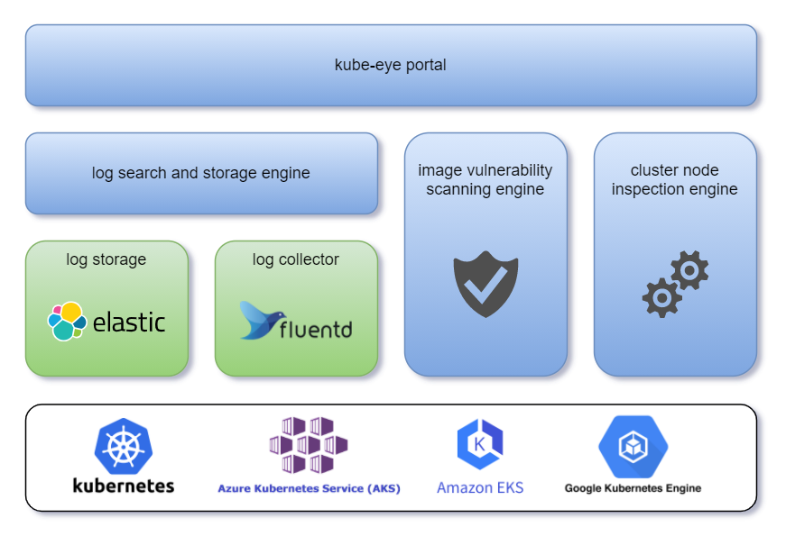

## 1. What is kube-eye
Kube-eye is an auxiliary tool specially designed for the kubernetes platform, providing a variety of practical functions to help you quickly locate problems in the cluster.

The list of functions currently included in kube-eye is as follows:
- Collect all Pod logs in the cluster and provide full-text search function.
- View the real-time log of the specified container, and support search word highlighting.
- Based on the CIS Kubernetes standard, scan the cluster nodes and give repair suggestions.
- Based on the security vulnerability database disclosed by each Linux distribution, scan all software packages in the mirror for possible security vulnerabilities.



Note that in the current version, in order to provide log retrieval services, kube-eye will temporarily store Pod logs, but it does not guarantee that the logs can be stored permanently. When you delete or redeploy kube-eye, the previously stored logs will also be cleared . Therefore, if you need to permanently store some Pod logs, you may need to find other solutions. In subsequent versions, we have plans to support permanent storage of logs, as well as data import and export functions.

## 2. Prerequisites
- Confirm that kubectl has been installed and configured locally.
- Ensure that the available memory of at least one node in the cluster is greater than 3GB.

## 3. Public IP installation method
This installation method is suitable for deploying kube-eye in cloud providers, such as AKS, EKS, GKS, etc. During the installation process, a public IP will be applied to the cloud provider to access the kube-eye service, which may incur additional costs.

### 3.1 Install kube-eye
Open your local terminal window and execute the following command to install kube-eye.
```
kubectl create ns kube-eye
kubectl create -f http://cdn.jsdelivr.net/gh/ivyentcn/ivyentcn.github.io/kube-eye/deploy/kube-eye-k8s1.18-loadbalance.yaml
```

### 3.2 Check the installation status
Next, wait for all Pods to reach the Running state, use the following command to view the Pod state, if everything goes well, you will see output similar to the following.
```
kubectl -n kube-eye get pods
NAME                              READY   STATUS    RESTARTS   AGE
pod/elasticsearch-logging-0       1/1     Running   0          1m30s
pod/fluentd-es-v3.1.0-gvsqj       1/1     Running   0          1m20s
pod/fluentd-es-v3.1.0-nwxfl       1/1     Running   0          1m20s
pod/kube-eye-5dd6779f4f-7974w     1/1     Running   0          1m30s
pod/kube-eye-worker-6gsvq         1/1     Running   0          1m33s
pod/kube-eye-worker-x5bwk         1/1     Running   0          1m33s
```

### 3.3 Visit kube-eye
Execute the following command, and find the external IP of kube-eye in the output, which is `10.100.100.100` in the following example.
```
kubectl -n kube-eye get svc
NAME                          TYPE           CLUSTER-IP     EXTERNAL-IP      PORT(S)             AGE
kube-eye                      LoadBalancer   10.0.248.249   10.100.100.100   80:32610/TCP        1m
elasticsearch-logging         ClusterIP      10.0.251.238   <none>           9200/TCP,9300/TCP   1m
elasticsearch-logging-inner   ClusterIP      None           <none>           9200/TCP,9300/TCP   1m
```

Now you can access the kube-eye page from your browser: `http://10.100.100.100`

## 4. Ingress installation method
If you have deployed [Ingress Controller](https://kubernetes.io/en/docs/concepts/services-networking/ingress-controllers) in your cluster, you do not need to assign a public IP for kube-eye separately.

### 4.1 Install kube-eye
Open your local terminal window and execute the following command to install kube-eye.
```
kubectl create ns kube-eye
kubectl create -f http://cdn.jsdelivr.net/gh/ivyentcn/ivyentcn.github.io/kube-eye/deploy/kube-eye-k8s1.18-ingress.yaml
```

### 4.2 Check the installation status
Next, wait for all Pods to reach the Running state, use the following command to view the Pod state, if everything goes well, you will see output similar to the following.
```
kubectl -n kube-eye get pods
NAME                              READY   STATUS    RESTARTS   AGE
pod/elasticsearch-logging-0       1/1     Running   0          1m30s
pod/fluentd-es-v3.1.0-gvsqj       1/1     Running   0          1m20s
pod/fluentd-es-v3.1.0-nwxfl       1/1     Running   0          1m20s
pod/kube-eye-5dd6779f4f-7974w     1/1     Running   0          1m30s
pod/kube-eye-worker-6gsvq         1/1     Running   0          1m33s
pod/kube-eye-worker-x5bwk         1/1     Running   0          1m33s
```

### 4.3 Create Entry
Finally, create an [Ingress resource](https://kubernetes.io/en/docs/concepts/services-networking/ingress/#the-ingress-resource) to access kube-eye, you may need to add the `in the following template kubeeye.k8s.local` is modified to your own domain name. Then execute it.

Applicable to `1.18` or earlier k8s:
```
kubectl create -f - <<< '
apiVersion: extensions/v1beta1
kind: Ingress
metadata:
  name: kube-eye
  namespace: kube-eye
  annotations:
      kubernetes.io/ingress.class: nginx
      nginx.ingress.kubernetes.io/backend-protocol: "HTTP"
spec:
  rules:
  - host: kubeeye.k8s.local
    http:
      paths:
      - backend:
          serviceName: kube-eye
          servicePort: 80
'
```

Applicable to `1.19` or newer k8s:
```
kubectl create -f - <<< '
apiVersion: networking.k8s.io/v1
kind: Ingress
metadata:
  name: kube-eye
  namespace: kube-eye
  annotations:
      kubernetes.io/ingress.class: nginx
      nginx.ingress.kubernetes.io/backend-protocol: "HTTP"
spec:
  rules:
  - host: kubeeye.k8s.local
    http:
      paths:
      - pathType: ImplementationSpecific
        backend:
          service:
            name: kube-eye
            port:
              number: 80
'
```

## 5. Uninstall kube-eye
### 5.1 Delete all components of kube-eye
```
kubectl delete -f http://cdn.jsdelivr.net/gh/ivyentcn/ivyentcn.github.io/kube-eye/deploy/kube-eye-k8s1.18-loadbalance.yaml
kubectl -n kube-eye delete ingress/kube-eye
```

### 5.2 Delete namespace
Finally, you can choose to delete the `kube-eye` namespace. Please make sure that there are no other resources in the namespace before deleting.
```
kubectl delete ns kube-eye
```
